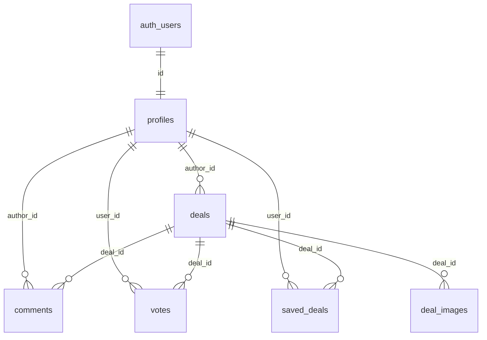

# Звіт аудиту DealFeed

## Стек

| Шар | Технологія |
|-----|------------|
| Мова | TypeScript 5.9 |
| UI | React 19, React Router DOM 7 |
| Збірка | Vite 7 |
| Стилі | Tailwind CSS 3, Lucide icons |
| БД | PostgreSQL (Supabase) |
| ORM | **Немає** — прямі запити через `@supabase/supabase-js` |
| Auth | Supabase Auth (GoTrue): email/password, Google OAuth, reset password |
| Безпека | Row Level Security (RLS) у SQL-міграціях |
| State | React Context + Hooks |

**Відсутнє:** Next.js, Prisma/Drizzle, окремий backend (Express/Fastify), Docker, tRPC, Edge Functions.

**Mock-режим:** без `VITE_SUPABASE_URL` / `VITE_SUPABASE_ANON_KEY` ([`src/lib/supabase.ts`](src/lib/supabase.ts)) додаток працює на локальних mock-даних ([`src/data/mockDeals.ts`](src/data/mockDeals.ts)).

---

## Структура папок

```
Dealfeed/
├── public/                    # статика (vite.svg)
├── src/
│   ├── main.tsx, App.tsx      # entry + routing
│   ├── components/            # 15 UI-компонентів (сторінки + UI)
│   ├── pages/                 # AdminPage.tsx (єдина «pages/» сторінка)
│   ├── contexts/              # Auth, Search, Theme, Language (останній не підключений)
│   ├── hooks/                 # useDeals, useFilteredDeals, useUserRole
│   ├── lib/                   # supabase client, utils
│   ├── types/                 # deal.ts, user.ts
│   ├── data/                  # mockDeals, mockUser, translations
│   └── constants/             # categories
├── supabase/migrations/       # 4 SQL-файли схеми БД
├── vite.config.ts, tailwind.config.js, eslint.config.js
├── package.json, README.md, .env.example
└── dist/                      # build output
```

---

## Схема бази даних

Схема в **Supabase SQL-міграціях** (не Prisma). Застосовувати: `002` → `003` → `004` (файл `001` — рання версія, дублює `002`).



### Таблиці

**`profiles`** — профіль користувача (FK → `auth.users`)
- `id`, `username` (unique), `avatar_url`, `bio`, `location`, `reputation`, `role` (`user` / `moderator` / `super_admin`), `created_at`
- Тригер автостворення при реєстрації

**`deals`** — пропозиції/знижки
- `id`, `author_id`, `title`, `description`, `price`, `original_price`, `discount`, `image_url`, `store`, `store_url`, `category`, `temperature`, `coupon_code`, `shipping_info`, `is_active`, `created_at`, `expires_at`
- `status` (`pending` / `approved` / `rejected`) — міграція `004`
- `search_vector` (full-text) — міграція `003`
- Тригер оновлення `temperature` при голосах

**`comments`** — коментарі до deals
- `id`, `deal_id`, `author_id`, `content`, `created_at`

**`votes`** — голоси (+1 / -1)
- `id`, `deal_id`, `user_id`, `value`, `created_at`
- UNIQUE `(deal_id, user_id)`

**`saved_deals`** — збережені deals
- `id`, `deal_id`, `user_id`, `created_at`
- UNIQUE `(deal_id, user_id)` — **не використовується у фронтенді**

**`deal_images`** — додаткові зображення
- `id`, `deal_id`, `url`, `position`, `created_at` — **не використовується у фронтенді**

---

## API / ендпоінти

**Власного HTTP API немає.** Усі операції — через Supabase SDK:

### Auth (`/auth/v1/*`)
- `getUser`, `signInWithPassword`, `signUp`, `signOut`, `signInWithOAuth` (Google), `resetPasswordForEmail`, `onAuthStateChange`
- Файл: [`src/contexts/AuthContext.tsx`](src/contexts/AuthContext.tsx)

### PostgREST (`/rest/v1/*`)

| Таблиця | Операції | Де використовується |
|---------|----------|---------------------|
| `deals` | SELECT (feed, pagination), INSERT, PATCH (status) | `useDeals`, `CreateDealForm`, `AdminPage` |
| `profiles` | SELECT, PATCH (role) | `AuthContext`, `useUserRole`, `AdminPage` |
| `comments` | SELECT, INSERT | `CommentsSection` |
| `votes` | SELECT, UPSERT, DELETE | `VoteButtons` |

### Клієнтські маршрути (React Router)

| Шлях | Компонент |
|------|-----------|
| `/` | HomePage |
| `/deal/:id` | DealPage |
| `/profile` | ProfilePage |
| `/create-deal` | CreateDealForm |
| `/admin` | AdminPage |
| `*` | 404 |

---

## Сторінки та компоненти

### Layout
- [`Header`](src/components/Header.tsx) — nav, search, theme toggle, auth modal trigger, «Додати пропозицію»
- Footer — inline у [`App.tsx`](src/App.tsx)
- [`Sidebar`](src/components/Sidebar.tsx) — фільтр категорій (sidebar stats/links — placeholder)
- [`ErrorBoundary`](src/components/ErrorBoundary.tsx)

### Deals
- [`HomePage`](src/components/HomePage.tsx) + [`DealList`](src/components/DealList.tsx) + [`DealCard`](src/components/DealCard.tsx) — feed
- [`DealPage`](src/components/DealPage.tsx) — деталі deal
- [`CreateDealForm`](src/components/CreateDealForm.tsx) — форма з модерацією (`status: pending`)
- [`DealPost`](src/components/DealPost.tsx) — розширена форма з upload — **не підключена** (мертвий код у App)
- [`VoteButtons`](src/components/VoteButtons.tsx), [`CommentsSection`](src/components/CommentsSection.tsx)

### Auth
- [`AuthModal`](src/components/AuthModal.tsx) — login/signup/forgot/Google (без окремих `/login`, `/register`)
- **Немає** сторінки `/reset-password` (хоча redirect на неї налаштований)

### Інше
- [`ProfilePage`](src/components/ProfilePage.tsx) — My Deals (OK), Saved (TODO), Settings (placeholder)
- [`AdminPage`](src/pages/AdminPage.tsx) — модерація + управління ролями
- [`LanguageSwitcher`](src/components/LanguageSwitcher.tsx) — **не підключений**

---

## Що вже працює (за кодом)

**Працює з Supabase (при налаштованому `.env.local` + міграціях):**
- Реєстрація / логін (email+password, Google OAuth)
- Створення deal через `/create-deal` з `author_id` і `status: pending`
- Модерація в `/admin`: approve/reject pending deals
- RBAC: ролі user/moderator/super_admin, guard на admin
- Feed deals з pagination (20 на сторінку), фільтр категорій, пошук, сортування (client-side)
- Голосування up/down з optimistic UI + persist у `votes`
- Коментарі: read + create
- Dark/light theme
- Responsive UI

**Працює без Supabase (mock):**
- Перегляд feed з mock-даних
- Mock login/signup (локально, без persistence)
- Коментарі — локальний fallback

**Частково / з проблемами:**
- `useDeals.addDeal` (мертва модалка `DealPost`) — INSERT **без** `author_id`/`status` → зламається після міграції `004`
- Feed фільтрує лише `is_active=true`, **не** `status=approved` (RLS має фільтрувати, але явного фільтра у коді немає)
- `upvotes`/`downvotes` у UI — завжди 0 з БД; `temperature` є, але не синхронізовано з vote counts у картках
- Завантаження зображень — лише URL-поле, `deal_images` і Storage не підключені
- `saved_deals` — таблиця є, UI — порожній масив
- i18n (EN/PL) — код є, провайдер не підключений
- Footer/sidebar links (`/about`, `/faq`, `/guidelines`) → 404

---

## Чого бракує для MVP

| Функція | Стан |
|---------|------|
| **Створення постів** | Частково: `/create-deal` OK; мертвий `DealPost`/`addDeal` — неконсистентний |
| **Голосування** | Реалізовано, але UI не показує реальні counts з БД |
| **Модерація** | Реалізовано в AdminPage; потрібен перший super_admin вручну в БД |
| **Коментарі** | Read + create OK; edit/delete, reply, likes — ні |
| **Реєстрація/логін** | Базово OK; reset-password сторінка відсутня; OAuth потребує Supabase dashboard setup |

**Додаткові MVP-прогалини:**
- Немає Supabase CLI/config.toml — деплой міграцій вручну
- Немає згенерованих DB types
- Конфлікт міграцій `001` vs `002`, `003` vs `004` (title min length)
- README не згадує міграції `003`/`004`
- Немає тестів
- Немає CI/CD

---

## TODO для MVP (за пріоритетом)

1. **Налаштувати Supabase end-to-end** — `.env.local`, застосувати міграції `002`+`003`+`004`, створити першого `super_admin`, перевірити RLS
2. **Уніфікувати створення deals** — видалити/підключити мертвий `DealPost`/`addDeal`; один шлях через `CreateDealForm` з `author_id` + `status: pending`
3. **Синхронізувати голосування з UI** — показувати `temperature` або агрегувати votes у feed/detail; refetch після голосу
4. **Сторінка reset password** — `/reset-password` для завершення auth flow
5. **Захист маршрутів** — redirect на login для `/create-deal`, `/profile`; показ pending deals автору в профілі
6. **Модерація: polish** — нотифікація автору після approve/reject; фільтр `status=approved` явно у `useDeals` (defense in depth)
7. **Saved deals** — CRUD для `saved_deals` у ProfilePage
8. **Зображення** — Supabase Storage або `deal_images` замість лише URL-поля
9. **Профіль** — edit username/avatar/bio; settings tab
10. **Коментарі MVP+** — delete власних; модератор delete any (RLS уже може бути)
11. **Підключити i18n** — `LanguageProvider` + `LanguageSwitcher` (PL/EN)
12. **Статичні сторінки** — About, FAQ, Guidelines (або прибрати dead links)
13. **Документація** — оновити README (React 19, міграції 003/004, bootstrap admin)
14. **Типи БД** — згенерувати `database.types.ts` з Supabase CLI
15. **Тести + CI** — smoke tests для auth/deals/votes; GitHub Actions lint+build
